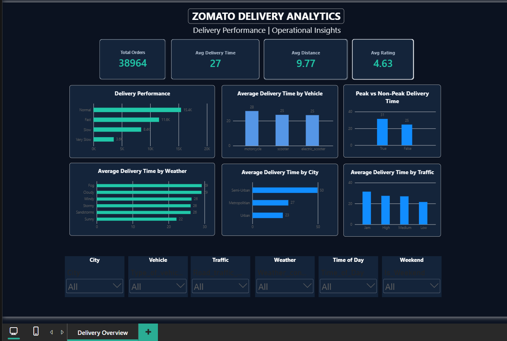

# Zomato Delivery Analytics

An end-to-end Data Analytics project analyzing Zomato food-delivery operations using **Python, MySQL, and Power BI**.

The project focuses on delivery performance, traffic, peak-hour operations, weather conditions, city-level performance, vehicle type, delivery distance, and customer experience.

## Project Objective

Understand the operational factors associated with delivery time and performance and convert the analysis into actionable business insights.

## Key KPIs

| KPI | Value |
|---|---:|
| Total Orders | 38,964 |
| Average Delivery Time | 27 min |
| Average Distance | 9.77 km |
| Average Rating | 4.63 / 5 |

## Key Insights

### Delivery Performance

| Performance | Orders |
|---|---:|
| Normal | 15.4K |
| Fast | 11.6K |
| Slow | 8.4K |
| Very Slow | 3.6K |

Normal and Fast deliveries form the largest segments, while Slow and Very Slow deliveries together account for approximately 30.8% of orders.

### Peak vs Non-Peak

| Period | Avg Delivery Time |
|---|---:|
| Peak | 31 min |
| Non-Peak | 25 min |

Peak periods show approximately 6 minutes higher average delivery time.

### Traffic

| Traffic | Approx. Avg Delivery Time |
|---|---:|
| Low | 21–22 min |
| Medium | 26–27 min |
| High | 27–28 min |
| Jam | 31–32 min |

### Weather

| Weather | Avg Delivery Time |
|---|---:|
| Sunny | 22 min |
| Windy | 26 min |
| Stormy | 26 min |
| Sandstorms | 26 min |
| Fog | 29 min |
| Cloudy | 29 min |

### City

| City Type | Avg Delivery Time |
|---|---:|
| Urban | 23 min |
| Metropolitan | 27 min |
| Semi-Urban | 50 min |

### Vehicle

| Vehicle | Avg Delivery Time |
|---|---:|
| Scooter | 25 min |
| Electric Scooter | 25 min |
| Motorcycle | 28 min |

## Power BI Dashboard



The dashboard includes:
- Total Orders
- Average Delivery Time
- Average Distance
- Average Rating
- Delivery Performance
- Vehicle performance
- Peak vs Non-Peak delivery time
- Weather impact
- City-level delivery time
- Traffic impact

Interactive filters:
- City
- Vehicle
- Traffic
- Weather
- Time of Day
- Weekend

## Project Workflow

```text
Business Problem
       ↓
Data Cleaning
       ↓
Exploratory Data Analysis
       ↓
Feature Engineering
       ↓
MySQL / SQL Analysis
       ↓
Power BI Dashboard
       ↓
Insights
       ↓
Business Recommendations
```

## Tools & Technologies

**Python:** Pandas, NumPy, Matplotlib, data cleaning, EDA, feature engineering

**SQL:** MySQL, aggregations, GROUP BY, CASE statements, CTEs, window functions, KPI analysis

**Power BI:** Data modeling, DAX, KPI cards, interactive dashboard, slicers, data visualization

## Repository Structure

```text
zomato-delivery-analytics/
├── README.md
├── .gitignore
├── data/
│   ├── raw/
│   │   └── zomato_Dataset.csv
│   └── processed/
│       └── zomato_final_cleaned_DATAset.csv
├── python/
│   └── zomato_delivery_eda.ipynb
├── sql/
│   ├── zomato_delivery_analysis.sql
│   └── zomato_delivery_insights.sql
├── powerbi/
│   └── zomato_delivery_dashboard.pbix
├── screenshots/
│   └── dashboard_overview.png
└── documentation/
    ├── business_questions.md
    ├── insights_and_recommendations.md
    └── project_summary.md
```

## Documentation

- [Business Questions](documentation/business_questions.md)
- [Insights & Recommendations](documentation/insights_and_recommendations.md)
- [Project Summary](documentation/project_summary.md)

## Business Recommendations

1. Improve rider allocation and dispatch planning during peak periods.
2. Incorporate traffic conditions into ETA and routing decisions.
3. Monitor weather-sensitive delivery conditions.
4. Investigate Semi-Urban delivery bottlenecks.
5. Evaluate vehicle allocation using distance, traffic, and city context.
6. Monitor Slow and Very Slow delivery segments.
7. Track delivery performance alongside customer ratings.

## Analytical Note

The analysis identifies relationships and patterns in the dataset. These relationships should not automatically be interpreted as proof of causation.

For example, higher delivery time in Semi-Urban areas may be associated with distance, traffic, restaurant availability, rider availability, or other factors.

## Dataset

Dataset source: https://huggingface.co/datasets/allenborochin/zomato_delivery_EDA

## Author

**Shivang Patel**

Data Analyst | SQL | Power BI | Python | Advanced Excel
